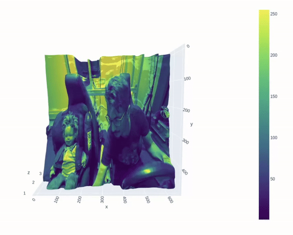
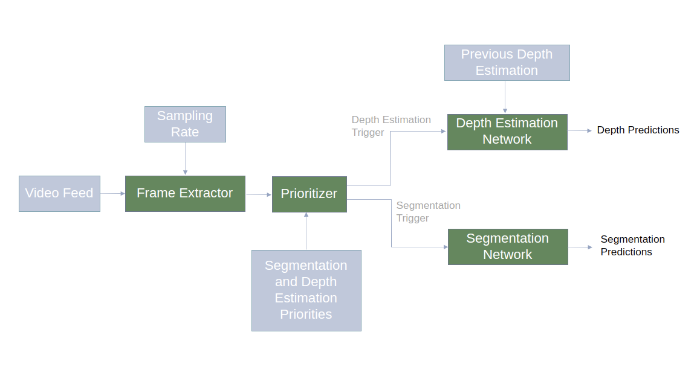
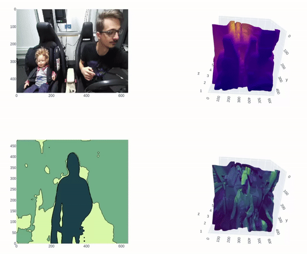

# Multi-Exit-Dense-Networks

&nbsp;
&nbsp;

## About

This project attempts to build a system to analyze video feed from the in-cabin camera using monocular depth estimation and semantic segmentation. 

## Architecture
The system will have four primary building blocks as in the following figure.
Those are:
* Frame Extractor
* Prioritizer​
* Depth Estimation Network​
* Segmentation Network​

## Results of the system

## Multi-exit prediction for depth and segments
TODO

## References
* Bhat, Shariq Farooq, Ibraheem Alhashim, and Peter Wonka. "Adabins: Depth estimation using adaptive bins." Proceedings of the IEEE/CVF Conference on Computer Vision and Pattern Recognition. 2021. https://github.com/shariqfarooq123/AdaBins
* Chen, Liang-Chieh, et al. "Rethinking atrous convolution for semantic image segmentation." arXiv preprint arXiv:1706.05587 (2017). https://pytorch.org/hub/pytorch_vision_deeplabv3_resnet101/
* Katrolia, Jigyasa Singh, et al. "Ticam: A time-of-flight in-car cabin monitoring dataset." arXiv preprint arXiv:2103.11719 (2021). https://vizta-tof.kl.dfki.de/cabin-dataset/
* Couprie, Camille, et al. "Indoor semantic segmentation using depth information." arXiv preprint arXiv:1301.3572 (2013).
* Cruz, Steve Dias Da, et al. "Sviro: Synthetic vehicle interior rear seat occupancy dataset and benchmark." Proceedings of the IEEE/CVF Winter Conference on Applications of Computer Vision. 2020. https://sviro.kl.dfki.de/
